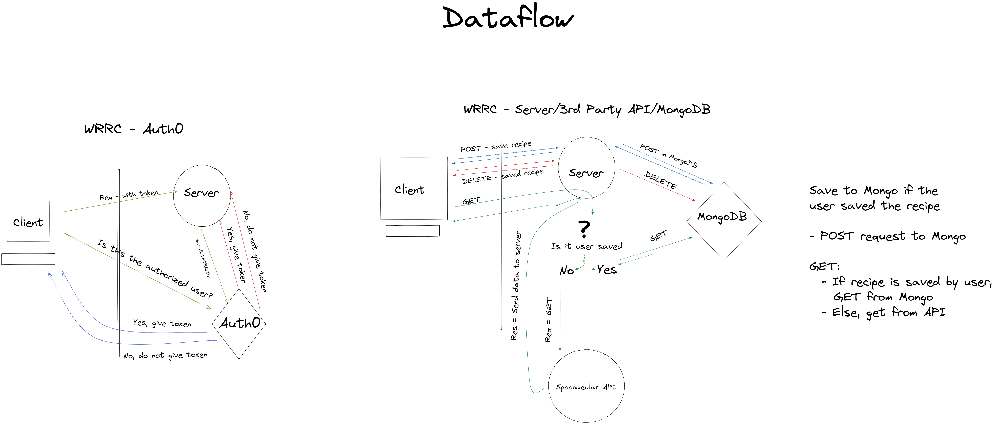

# my-kitchen-frontend

This app takes in available ingredients from the user and calls upon the spoonacular API to present the user a variety of recipes using said ingredients. The app consists of a backend RESTful API built with express and node.js, and a React client frontend using the bootstrap library.
The vision of My Kitchen is to create an app that allows users to enter their available ingredients and receive a variety of recipes that incorporate them, and provide complementary wine pairings.
My Kitchen aims to solve the logistical dilemma of using remaining pantry items and incorporating them into delicious recipes with wine pairing suggestions.
**Version**: 1.0.0

### Contributors

- Kevin LaMarca
- Regan Hayes
- Hambalieu Jallow
- Shane Roach

### Domain Modeling:

### Dataflow:

### Dependencies

- React
- React-bootstrap
- Bootstrap
- Axios
